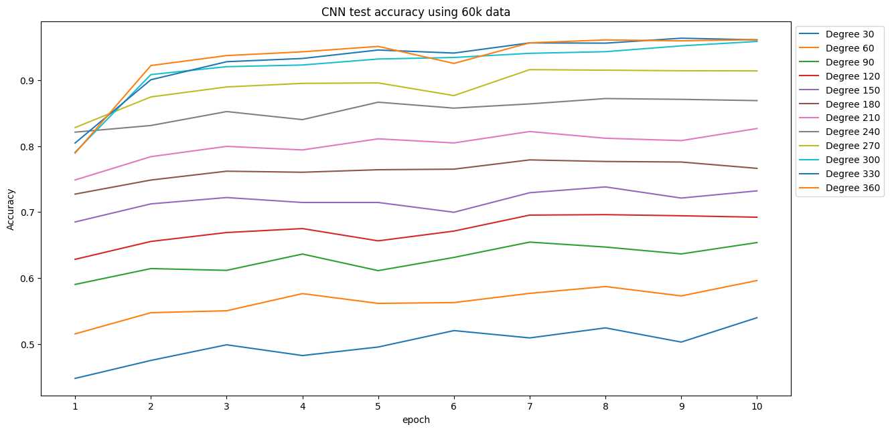
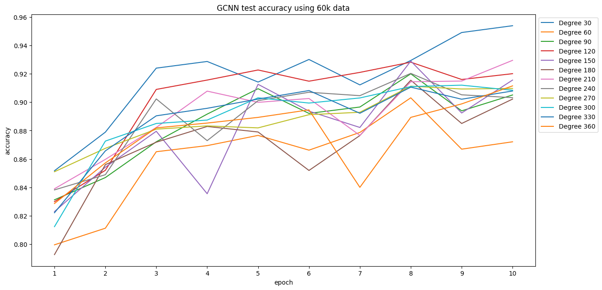
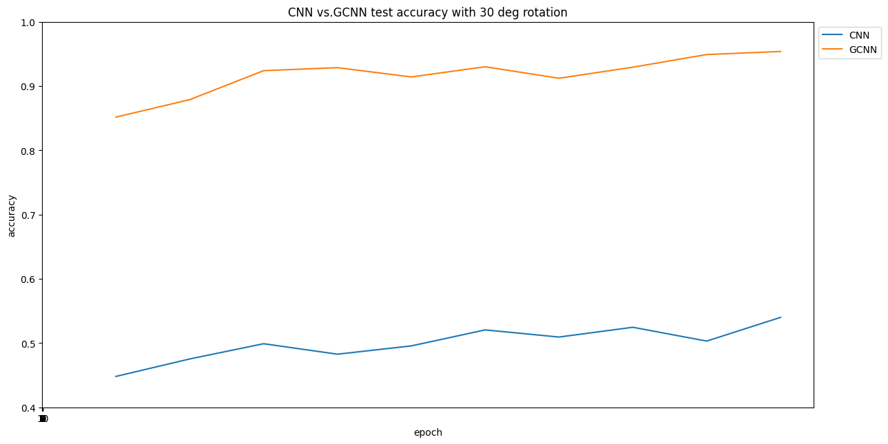
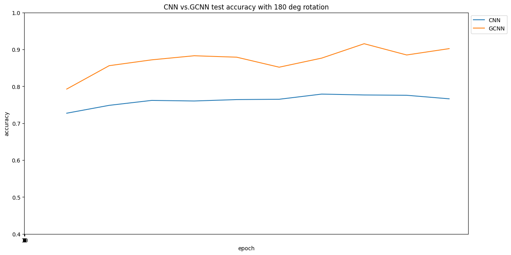
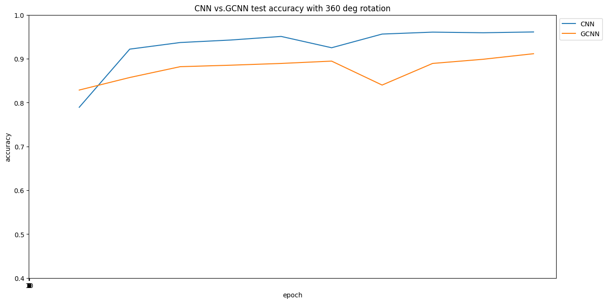
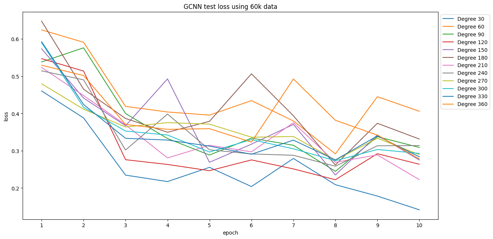
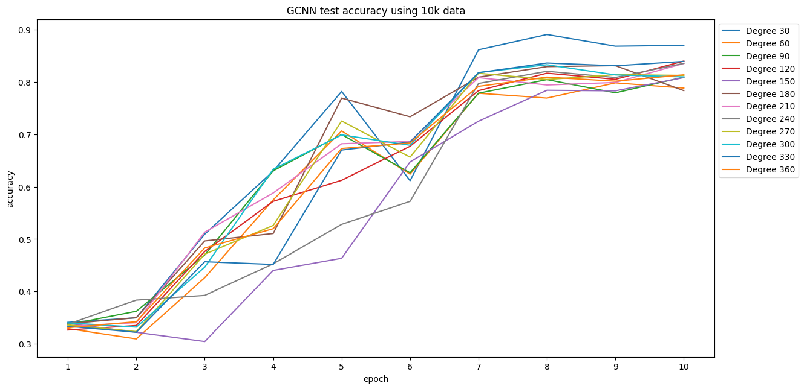
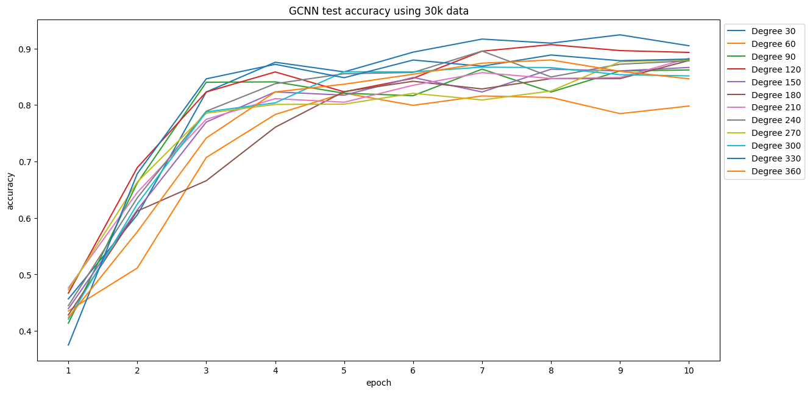
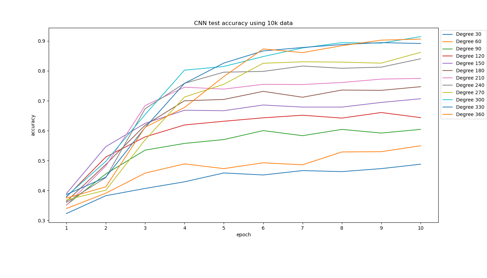
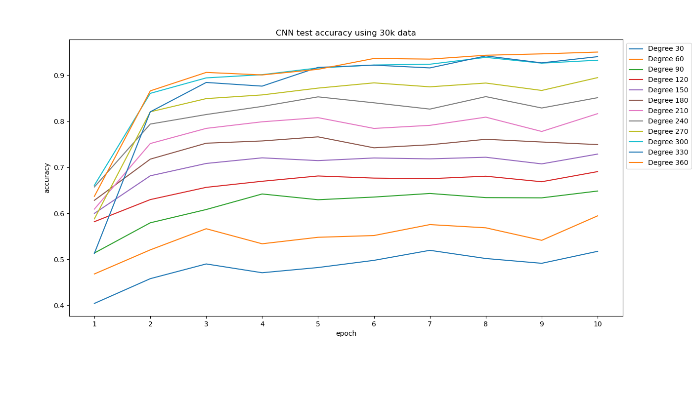

# CNN vs. Group CNN for Rotated MNIST Classification
Sean Yu, Ziqing Lin

## Abstract

In this project  the performace between Convolutional Neural Networks (CNNs) and Group Convolutional Neural Networks (Group CNNs) was compared. Experiments were performed by systematically changing the training data of both the CNN and Group CNN models. Two different change were considered, first was the amount of rotation of the MNIST dataset and secondly was the amount of augmented data used to train the models. The trained models were tested on a randomly rotated (0 to 360 degrees) MNIST dataset. To be more specific, the training data underwent augmentation through random rotations up to a specified degree. Then the upper limit of random rotations was systematically increased across the experiments. The results showed that group convolution neural networks performed similarly across when applying various rotations on the training data. This is to be expected as the Group CNN is supposed to perceive rotated training data similarly. The CNN would gradually improve performance and would reach similar levels to the Group CNN when the training data had a random rotation up to 300 degrees was applied. When considering smaller datasets, the CNN trained on randomly rotated data with degrees up to 300 achieved similar accuracy to the Group CNN models. This implies that neither model has an advantage when trained with less data, unless the data is not rotated, which would favor the Group CNN.

## Overview

The motivation of this project is to understand to experiment with a model from a relatively new branch of deep learning, namely geometric deep learning. Geometric deep learning has become popular for its enhanced utilization of inductive biases in data, potentially leading to higher accuracy compared to traditional models with the same data. 

This project specifically looked at a class of equivariant model called group convolution neural network (Group CNN\*). Equivariant models in particular make use of intrinsic geometric structure in the data to achieve better performance. These structures are described by using the field of mathematics called group theory.  

This project aims to gain a deeper understanding of the advantages offered by group CNN models by comparing them with traditional deep learning architectures that undergo data augmentation during training. The effect of limiting the training data in combination with systematic augmentation was considered.

In this project the rotated MNIST dataset was used. The training data was augmented systematically by applying a random rotation on an unrotated dataset. The range of degrees that the data was rotated was incrementally increased until it reached 360. In other words, the training data underwent rotation, with the degree of rotation randomly chosen from a range 0 to X. The upper limit, X, started at 30 degrees and was incremented by 30 until it reached 360 degrees. 

The models were additionally trained on different dataset sizes to understand the impact of restricting the amount of training data on their performance. The original MNIST dataset had 60k data. Therefore the models were also trained datasets of size 30k and 10k. The restricted datasets were chosen randomly.

### Key Results

The results are further explained through graphs below but to summarize.
 - The CNN model achieved similar performance to the Group CNN when the data was augmented randomly by degrees up to 300. 
 - Taking the first point into account, neither model has any particular benefits when trained with less data given that the CNN is trained with sufficiently augmented data. 

### Limitations and additional considerations
Initially we had also intended to perform these experiments on a medical dataset such as the PatchCamelyon (PCam) dataset which is of identifying cancer cells. However, due to time constraints this was not possible.

We did not compare the time it took for these models to be trained since that would heavily depend on the implementations of the models. However, it should be noted that Group CNN's perform more operations than a traditional CNN.

Although the results indicate that performing augmentations can result in more traditional models having similar performance in other use cases this may be untrue. A major reason could be because there are times where we do not know of the degree of equivariance that exists in a dataset beforehand. To further explain, in these experiments we knew that the training dataset would be rotated by 360 degrees, however in real data the number of rotation may not be known before training the data. 

\* Used the abbreviation 'Group CNN' rather than 'GCNN' since we used GCNN to describe Graph Convolution Neural Networks in class.

## Experiment Setup

The experiments were performed using the Discovery cluster. The model code was adapted from a tutorial provided by the University of Amsterdam's course on Deep Neural Networks. The link to this tutorial can be found in the refrences at the bottom of this document. The CNN model was implemented using the PyTorch framework, while the Group CNN architecture was directly coded into the implementation. The CNN had 5 convolutional layers (1 directly applied to the inputs and 4 hidden) with hidden layers having 32 channels. The Group CNN assumed to be order 4, meaning that it accounts for rotations of 90 degrees (0, 90, 180, 270). Note the number of channels in the Group CNN was set to 16 such that the models would have a similar number of parameters (Group CNN has 102k and the CNN had 103k). The number of epochs was set to 10, this was found to be enough as the training accuracy consistently reached at least 95%.

The following is a summary of parameter choices.

- **Parameter Choices:** Identical model parameters for both CNN and Group CNN. We used the same learning rate, batch size, and max epoch.

- **Degree of Rotation:** Varied the degree of rotation for training data in the range [0, 30], [0, 60], ..., [0, 360], and evaluated both CNN and Group CNN models on an augmented MNIST test set with images randomly rotated between [0, 360].

The code, tensorboard loggers and extracted results for the models are provided in the github.

## Experiment Results

- **Accuracy Comparison between CNN and Group CNN:** Group CNN typically outperformed CNN in terms of accuracy when classifying rotated MNIST digits. Only when the dataset was rotated by at least 300 degrees would the CNN achieve a similar performace.

The following plots compare the test accuracy of a Convolutional Neural Network (CNN) and a Group Convolutional Neural Network (Group CNN) over 10 epochs of the full MNIST dataset (60k instances). It is found that the CNN's ability to generalize and predict accurately on the test set increase as the input data's rotational degree increase, while there is no clear trend of how Group CNN's performance varies with the degree of rotation. Moreover, CNN test accuracies generally show a steady increase with each epoch,  suggesting the model is learning and improving its predictions over time, while Group CNN test accuracies display more fluctuation across epochs. 

The following figure under varying degrees of rotation (30, 180, and 360 degrees) is plotted to further compare the accuracy between CNN and Group CNN. 

At 30 degrees of rotation, the accuracy of Group CNN is significantly higher than that of CNN, indicating that Group CNN has better rotational invariance compared to CNN. The gap between the two models is large, with Group CNN having accuracy above 0.8, while CNN accuracy is  above 0.4.

At 180 degrees of rotation, both models experience an increase in accuracy compared to the 30 degrees scenario, but the increase is more prominent for the CNN. The gap between the two models starts to shrink, indicating that as the degree of rotation increases, with Group CNN having accuracy above 0.8, while CNN accuracy is  above 0.7 , CNN's performance increase at a faster rate than Group CNN
. Group CNN also shows a notable dip in performance around the midpoint of the epochs, but it recovers towards the end.

At 360 degrees of rotation, the performance gap between CNN and Group CNN further narrows with Group CNN having overall accuracy above 0.9, while CNN accuracy is  above 0.8 . Group CNN still have better overall accuracy than CNN, but at the beginning, CNN displays higher accuracy than  the accuracy of Group CNN
. 

<!-- 

    
    
    

-->

- **Loss Comparison between CNN and Group CNN:** Group CNN consistently displays lower loss compared to CNN when classifying rotated MNIST digits. Similar to the results of accuracy, the test loss for CNN decreases as epochs increase, which is the opposite trend as the accuracy. This is expected since loss can be viewed as the deviation between the true values and the predicted values, the lower the loss, the smaller the error, thus higher the accuracy. In addition, it is also found that there is no clear trend of how Group CNN
's performance varies with the degree of rotation.

Both the accuracy curve and the loss curve have shown a clear trend between CNN and the degree of rotation and a lack of trend for the Group CNN model. 

- **Cost-Effectiveness of Group CNN:**  By comparing the test accuracy of a Group Convolutional Neural Network (Group CNN) trained with 10k, 30k, and 60k data instances over 10 epochs, it is observed that there is a clear correlation between dataset size and model performance. The larger the datasets the faster and higher the accuracy across all degrees of rotation.

For 10k dataset, Group CNN model initially shows a steep learning curve from epoch 1 to epoch 4, after epoch 4, the test accuracy starts to plateau, with only slight improvements or variations up to epoch 10.
For 30k dataset, shows a steeper learning curve, suggesting that the model learns more effectively than the 10k dataset. After epoch 4, Group CNN reaches plateau with most degrees reaching over 80% accuracy.
For 60k dataset, Group CNN model shows the steepest learning curve, and reaches the highest accuracy with most lines surpassing 90% accuracy.

The following are the figures for CNN trained on restricted number of data.

## Discussion
- **Accuracy Comparison** The results suggest that while Group CNN generally outperforms CNN in terms of accuracy, especially with lower degrees of rotation, the performance advantage of Group CNN diminishes as the degree of rotation increases. This is because of the design of Group CNN as discussed in introduction, allowing it to learn and generalize better than CNN, leading to higher test accuracy. On the other hand, CNN's performance, while lower at low degree of rotation, shows more statbility over epoch. CNN's test accuracy remained stable across different epoch, while Group CNN
's accuracy showed more fluctuation, indicating potential flexibility but occasional performance variations.

- **Cost-Effectiveness:** Both models were evaluated on subsets of the MNIST dataset:
  - With 10,000 samples, both models displayed varying accuracies, with some lines reaching or exceeding 80%.
  - Using 30,000 samples, the accuracies generally improved, with a majority falling between 80% and 90%.
  - With the full 60,000-sample dataset, both models excelled, with most lines surpassing 90% accuracy. Group CNN
 proved cost-effective with reduced datasets.

## Conclusion
To summarize, Group CNN has a significant advantage over CNN at lower degrees of rotation due to its ability to leverage the geometric structure of the data. However, as the degree of rotation increases in the training data, the advantage of Group CNN diminishes. In terms of cost-effectiveness, Group CNN's ability to maintain high accuracy with reduced datasets can reduce data acquisition costs and computational requirements. Future work can be done by  mitigating performance fluctuations in Group CNN by hyperparameter tuning, and optimizing the model's architecture for rotated image tasks.
Last but not least, this study have shed light to model selection in real world application. When dealing with complicated medical images rather than simple MNIST data, it is likely that Group CNNs might be more adept due to their ability to exploit relational or geometric structure, additionally, Group CNNs might require less data to achieve high performance. However, CNNs might perform equally well by preprocessing the training data to include the expected variations in the test data, e.g. rotations.

Another further study could be on steerable neural networks which is an improvement on the Group CNN. The group CNN architecture is limited by the number of group representations that are chosen. For example, in the experiment above 4 representations of rotations were chosen (0, 90, 180, 270 degrees). In steerable neural networks, features are described using a continuous representation, eliminating limitations on the choice of number of representations.

## References

University of Amsterdam Group Convolution Tutorial

https://uvadlc-notebooks.readthedocs.io/en/latest/tutorial_notebooks/DL2/Geometric_deep_learning/tutorial1_regular_group_convolutions.html

